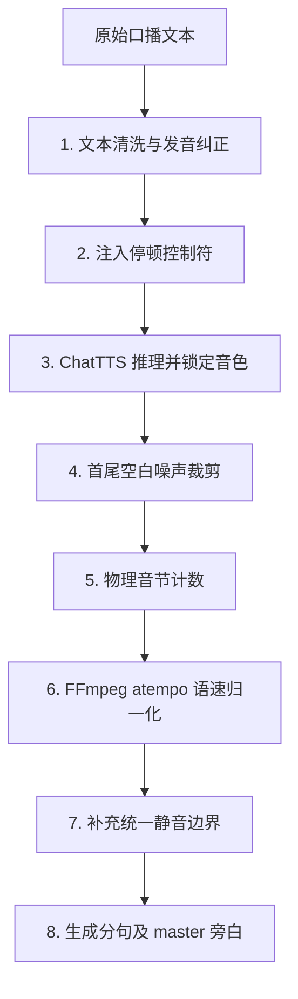

# 🎙️ ChatTTS 语音生成与语速归一化实用指南

本 Skill 沉淀了使用 ChatTTS 生成高质量、语速均匀、音色一致的技术口播配音的完整工程化实践。适用于需要本地生成纯正中文/中英混读旁白，且要求语速绝对均一、声画精确卡点的视频制作场景。

---

## 📌 核心模块工作流



---

## 🛠️ 技术实现详解

### 1. 音色锁定与防漂移 (Timbre Lock & Seed Control)
ChatTTS 的音色容易在连续生成中发生漂移。必须使用固定的 Speaker Embedding，并在生成**每一个分句前重置 PyTorch 随机种子**。

* **保存与加载 Speaker**：
  ```python
  # 首次生成后保存音色向量
  torch.save(spk_emb, 'female_speaker.pt')
  
  # 后续加载
  rand_spk = torch.load('female_speaker.pt', weights_only=True)
  ```
* **推理参数配置**：
  为了实现最稳定的发音，建议使用极低的 `temperature` 进行贪婪生成：
  ```python
  params_infer_code = ChatTTS.Chat.InferCodeParams(
      spk_emb=rand_spk,
      temperature=0.00001,
      top_P=0.1,
      top_K=1,
      prompt='[speed_8]',  # 默认提示词基础语速
      max_new_token=8192
  )
  ```
* **分句前重置种子（核心）**：
  ```python
  torch.manual_seed(3344)
  torch.cuda.manual_seed_all(3344)
  wavs = chat.infer([cleaned_text], params_infer_code=params_infer_code)
  ```

---

### 2. 文本清洗与发音替换 (Text Cleaning & Pronunciation Overrides)
ChatTTS 无法直接读好特殊符号、数字以及非标准排版的英文单词，容易造成念错（如 `SQLite3` 读成 `S Q 噢太三`）或导致音色崩溃。

* **发音替换规则**：
  1. **数字转中文**：所有数字必须在清洗阶段翻译为中文汉字（如 `0.75` -> `零点七五`, `3` -> `三`）。
  2. **英文缩写与专有名词**：在英文 acronym 两侧及字母之间填充空格使其按字母发音（如 `MCP` -> ` M C P `, `SQL` -> ` S Q L `），对连读词使用汉字或清晰的英文分段（如 `SQLite` -> ` S Q Lite `）。
  3. **标点转停顿控制符**：将句读符号替换为 ChatTTS 专用的声学停顿标记：
     - `，` / `：` / `；` 替换为 ` [uv_break] `（无声停顿，通常为 100-300ms）。
     - `。` / `！` / `？` 替换为 ` [v_break] `（有声/换气停顿，通常为 300-500ms）。

* **清洗代码示例**：
  ```python
  def clean_text(text):
      t = re.sub(r'<[^>]*>', '', text).replace('\n', ' ')
      t = t.replace('SQLite3', ' S Q Lite 三 ')
      t = t.replace('SQLite', ' S Q Lite ')
      t = t.replace('0.75', '零点七五')
      t = t.replace('MCP', ' M C P ')
      t = t.replace('，', ' [uv_break] ').replace('。', ' [v_break] ')
      t = re.sub(r'\s+', ' ', t).strip()
      return t
  ```

---

### 3. 静音裁剪 (Silence Trimming)
ChatTTS 在生成句首和句尾时，会伴随随机长度的低频噪音或完全静音，导致拼接后有突兀的空档。必须使用幅度门限自动切除首尾。

* **门限裁剪算法**（采样率 `24000Hz`，门限 `0.01`，首尾保留 `50ms` 渐变窗口以防爆音）：
  ```python
  def trim_silence(chunk_wav, rate=24000):
      threshold = 0.01
      abs_wav = np.abs(chunk_wav)
      above_threshold = np.where(abs_wav > threshold)[0]
      if len(above_threshold) > 0:
          start_idx = above_threshold[0]
          end_idx = above_threshold[-1]
          window = int(rate * 0.05)  # 50ms 缓冲窗
          start_idx = max(0, start_idx - window)
          end_idx = min(len(chunk_wav) - 1, end_idx + window)
          return chunk_wav[start_idx:end_idx+1]
      return chunk_wav
  ```

---

### 4. 基于物理音节的 FFmpeg 语速归一化 (Speed Normalization)
中英混读时，单纯数“字符数”会严重高估英文单词的音节（如 `Markdown` 算 8 个字符，但实际只占 2 个音节的时间）。必须计算**物理音节（Syllables）**并调用 FFmpeg 的 `atempo` 滤镜变速。

* **音节估算逻辑**：
  ```python
  def count_syllables(cleaned_text):
      # 定义英文单词及其对应的中文等价音节数
      eng_syllables = {
          "skill": 1, "markdown": 2, "cursor": 2, "claude": 1, "code": 1,
          "initial": 3, "lite": 1, "memo": 2, "insert": 2, "open": 2,
          "archive": 2, "recall": 2, "difflib": 2, "remember": 3, "outcome": 2,
          "success": 2, "failure": 2, "hook": 1, "create": 2, "list": 1,
          "release": 2, "closed": 1, "timeline": 2, "select": 2, "dev": 1,
          "log": 1, "data": 2, "learning": 2
      }
      t = cleaned_text.replace('[uv_break]', ' ').replace('[v_break]', ' ')
      tokens = t.split()
      total_syllables = 0
      for token in tokens:
          # 如果是纯英文单词
          if re.match(r'^[a-zA-Z]+$', token):
              word_lower = token.lower()
              if len(word_lower) == 1:
                  total_syllables += 1  # 散装字母（如 S、Q、L）各占 1 音节
              elif word_lower in eng_syllables:
                  total_syllables += eng_syllables[word_lower]
              else:
                  total_syllables += max(1, len(word_lower) // 3)  # 兜底估算
          else:
              # 中文字符每个占 1 音节
              for char in token:
                  if ord(char) > 127 or char.isalnum():
                      total_syllables += 1
      return total_syllables
  ```

* **FFmpeg 变速调整 (atempo)**：
  将去除首尾噪音的音频时长与目标时长进行比对，计算变速因子 `factor = curr_dur / target_dur`。目标语速建议设定在 **`5.30` 音节/秒**：
  ```python
  import tempfile
  import subprocess

  def change_audio_speed(wav_data, sr, factor):
      if abs(factor - 1.0) < 0.01:
          return wav_data
      
      with tempfile.NamedTemporaryFile(suffix=".wav", delete=False) as f_in, \
           tempfile.NamedTemporaryFile(suffix=".wav", delete=False) as f_out:
          in_path = f_in.name
          out_path = f_out.name
      
      try:
          wav.write(in_path, sr, wav_data)
          # 使用 ffmpeg 变速（atempo 确保不改变音调）
          cmd = ["ffmpeg", "-y", "-i", in_path, "-filter:a", f"atempo={factor:.4f}", out_path]
          subprocess.run(cmd, stdout=subprocess.DEVNULL, stderr=subprocess.DEVNULL, check=True)
          rate, out_data = wav.read(out_path)
          # 归一化为 float32 [-1.0, 1.0]
          if out_data.dtype == np.int16:
              out_data = out_data.astype(np.float32) / 32768.0
          return out_data
      finally:
          os.remove(in_path)
          os.remove(out_path)
  ```

* **静音边界补全 (Padding)**：
  变速完成后，再补入精确可控的静音边界（如段首 `0.1s`，段尾 `0.3s`），最后保存为缓存文件。

---

## 📈 声画时间线自动同步工作流

语速归一化会改变每一句配音的实际长度，因此需要程序化同步视频前端的 GSAP 时间线：

1. **导出 `timings_report_v2.json`**：
   在音频合成逻辑中，将每一个 Block 变速后的声学起始、结束时间（以秒为单位）记录到 JSON 中：
   ```json
   {
     "total_duration": 308.73,
     "captions_data": [
       { "id": "s1-b1", "start": 1.5, "end": 3.66, "text": "..." }
     ]
   }
   ```
2. **比例拉伸 GSAP 关键帧**：
   编写脚本（如 `sync_all_timings.py`），读取新旧边界时域，利用比例映射（Linear Interpolation）线性重写 `overlays.html` 中 GSAP 时间线的绝对秒数：
   ```python
   def map_time(t, old_bounds, new_bounds):
       # 找到 t 所在的场景区间，并进行等比拉伸插值，重写 gsap(..., timestamp)
   ```
3. **字幕轨道编译**：
   运行 `update_captions_v3.py`，根据 timings 重新切割断句，按字数和英文权重比例，将时间轴映射输出为全新的 `captions.html`。
